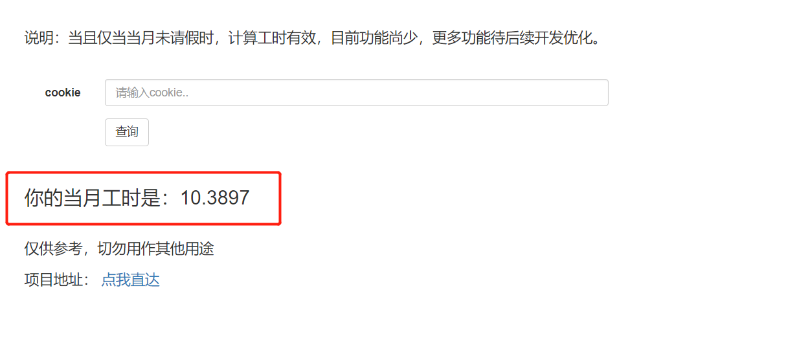

# 计算工时

> 说明：更多功能待后续开发优化。
> 

#### 语言及环境
* python 3.8

#### 目前功能
- 计算当月工时

#### 待完善功能
- [x] 可填写请假时长
- [ ] 往月工时时长
- [ ] 每日工时可视化

#### 食用方法 :meat_on_bone:
+ 下载到本地，直接运行调试
+ 使用docker进行部署
    1. 进入项目目录：`docker build -t working-time:1.0 .`
    2. `docker run -it --rm -p 5010:5010 -v /home/working-time:/home/working-time working-time:1.0`
    

